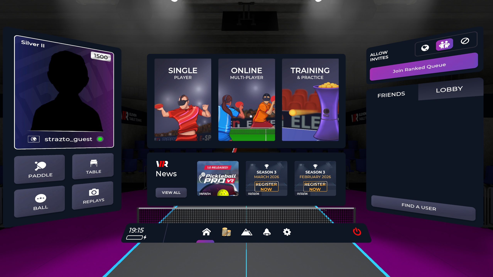
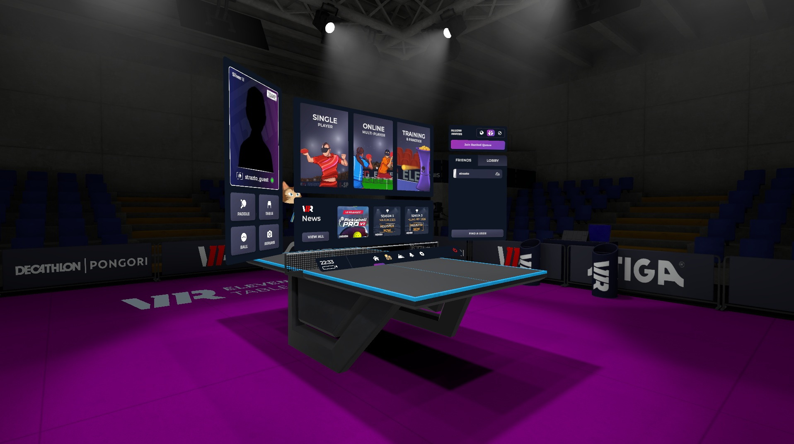

# ett_auto_spectate_simple
A simple tool to follow a user while jumping from one room to another in ETT

*based on https://github.com/jerryfromearth/ett-auto-spectate*

# Introduction

ETT has a tool to enter arenas as guest user spectators to watch ongoing matches.
Unfortunately this feature requires the spectator to click on UI elements to follow the user when they enter each new room.
To solve this problem, the `ett_auto_spectate` script will listen to the server to detect when the user is in a room then will proceed clicking on all the right places of the interface to enter the same room as spectator.

# Prerequisites

You'll need to have python and `uv` installed to run the script.
[See uv docs](https://github.com/astral-sh/uv)

# Configuration (Camera and guest account settings)

  1. start the spectator script from your computer, it should be under "C:\Program Files\Oculus\Software\Software\for-fun-labs-eleven-table-tennis-vr\ElevenStartJust2d.bat"
  2. Camera Positioning
     1. **important** Default Camera must be centred on menu
        - in order for the menu positioning and automation to work, you need to set your camera 0 to be roughly centred on the main menu like the following:
        - 
        - It doesn't have to be exact, but it should be framed pretty close to that (with just a tiny bit of space to the borders)
        - It probably wont work if your display aspect ratio is different from 16:9
        - Use shift+0 to save the default camera position once you line it up
     2. **important** Camera 1 should be somewhere out of the way
        - Once you join a room, the spectator will start positioned at position 0 immediately
        - This is actually pretty distracting, as their avatar will block your vision in-game
        - To fix this, upon joining, the specator repositions to camera 1
        - Change camera 1 to something out of the way, so it doesn't distract you too much
          - eg:
            
    3. Extra cameras
       - Wherever camera 1 goes will be visible to you and your opponent
       - This might be distracting
       - If you want to spectate without worrying about where the guest account stands
         you can configure a third camera (Eg, Camera 2) on a secondary display in `Advanced > Spectator` settings
       - The secondary display would be the window you stream on eg OBS in that case
       - This is a bit fiddly, so I wont get into it
  3. **Important** Guest Account:
     - Enable guest:
       - in your Eleven desktop settings, go:
       - `Advanced > Network`
       - and ensure `Use Guest Account` is **ENABLED**
     - Add your main account as a friend on the guest
       - The guest account should have exactly one friend added - your main account
       - This ensures that the control to select your main account (and spectate it) is always in the same position
       - Add your main account from the guest desktop, and from your headset, accept this


# Running the script
Open a terminal and run the command:
```powershell
uv run .\spectate.py -u your_username
```

